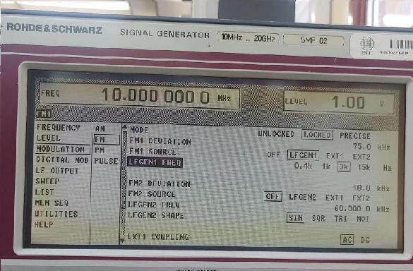
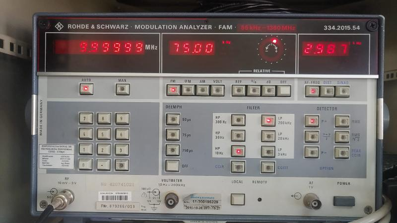

# Demodular una señal de FM con un osciloscopio digital

El osciloscopio es quizás la herramienta más popular entre los electrónicos.  
Sin embargo, no suele ser lo primero que se nos ocurre usar a la hora de **demodular una señal de FM** o medir la **desviación de frecuencia**.

En este repositorio se incluyen varios archivos `.CSV` capturados con un **osciloscopio digital Siglent**, a partir de un **generador R&S SMP02** con:
- Frecuencia portadora: `fc = 10 MHz`  
- Desviación: `75 kHz`  
- Señal modulante senoidal: `3 kHz`

  

En el notebook `FM_csv.ipynb` se desarrollan los pasos para obtener la **banda base compleja** y realizar la **demodulación mediante un detector de cuadratura**.  
Los resultados obtenidos son coherentes con las mediciones del **analizador de modulación R&S FAM**.

  

